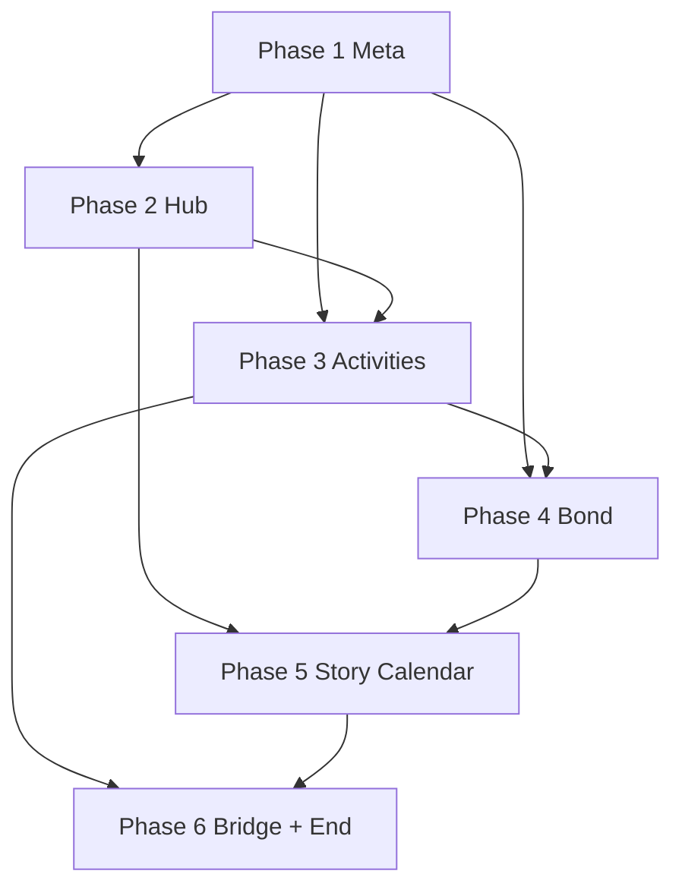

# Persona Calendar System — Implementation Plan

**Date:** 2026-07-11  
**Design spec:** [`../specs/2026-07-11-persona-calendar-design.md`](../specs/2026-07-11-persona-calendar-design.md)  
**Target:** Unity 6 · `Assets/FracturedChorus/`  
**Estimate:** 6 phases · ~3–4 tuần (1 dev)

---

## 0. Principles

- Logic trong `.cs`; scene chỉ layout + serialized refs (theo `UNITY_WORKFLOW.md`)
- Namespace mới: `FracturedChorus.Meta`, `FracturedChorus.Hub`, `FracturedChorus.Social`
- Data-driven qua ScriptableObject; story dates/flags trong SO, không hardcode trong controller
- MVP: stub dialogue OK; canon đầy đủ sau từ Google Doc
- Mỗi phase có **acceptance criteria** trước khi sang phase kế

---

## Phase 1 — Meta foundation (2–3 ngày)

### 1.1 Types & enums

| File | Nội dung |
|------|----------|
| `Meta/GameDate.cs` | `struct GameDate { int Month, Day; }` + compare, add day, format `DD/MM` |
| `Meta/DayPhase.cs` | `Morning, Day, Evening` |
| `Meta/SocialStat.cs` | 5 stats + exp/rank helpers |
| `Meta/EchoKey.cs` | 12 keys (6 active MVP) |
| `Meta/CalendarState.cs` | date, phase, slotsUsed, morningQuizDone |
| `Meta/SocialStatsState.cs` | 5 × (rank, exp) |
| `Meta/BondProgress.cs` | npcId, rank, exp, echoKey |
| `Meta/BondState.cs` | `Dictionary<string, BondProgress>` |
| `Meta/StoryFlags.cs` | `Dictionary<string, bool>` + typed accessors cho flags §16 |
| `Meta/RunSnapshot.cs` | seed, floor, sector, nodeId |
| `Meta/GameMetaState.cs` | aggregate + `NewGame()`, `AdvanceDay()`, `ConsumeSlot()` |

### 1.2 Persistence

| File | Nội dung |
|------|----------|
| `Meta/GameMetaSaveLoad.cs` | JSON serialize → `Application.persistentDataPath/fc_meta_save.json` |
| `Meta/GameMetaSession.cs` | static singleton load/new; bridge từ `RunProfile` |

**Acceptance Phase 1:**
- [ ] `NewGame()` → date `09/01`, phase Morning, flags rỗng
- [ ] `AdvanceDay()` 09/01→09/02; slot reset
- [ ] Save/load round-trip giữ date, stats, flags
- [ ] Unit test hoặc Editor menu **Fractured Chorus → Meta → Test Save Round-Trip**

---

## Phase 2 — Hub scene & daily loop (3–4 ngày)

### 2.1 Scene & catalog

| Task | Detail |
|------|--------|
| `Scenes/CampusHub.unity` | BG `hima-campus-background.png`, Canvas hub UI |
| `RunMap/RunMapSceneCatalog.cs` | +`CampusHub`, `OpeningInvestigation`, `OpeningCeremony`, `SocialEventScene` |
| `RunMap/RunMapSceneLoader.cs` | resolve paths mới |
| Build Settings | thêm scenes mới |

### 2.2 Hub controller

| File | Nội dung |
|------|----------|
| `Hub/CampusHubController.cs` | state machine: Morning → Day → Evening → advance |
| `Hub/CalendarUIView.cs` | hiển thị `09/05 · Day · Slot 0/2` |
| `Hub/ActivityPickerUI.cs` | list activity available; on select → `ActivityResolver` |
| `Hub/HubPhaseDriver.cs` | morning quiz gate → picker → consume slot |

### 2.3 Flow wiring

```
CampusHubController.Start()
  → load GameMetaSession
  → CalendarEventScheduler.CheckForcedEvents()
  → run current phase beat
```

**Acceptance Phase 2:**
- [ ] Play từ menu → PrologueVN → CampusHub `09/01`
- [ ] Chọn Rest (Day) → slot 1/2 → Evening picker hiện
- [ ] Hết 2 slot → auto `09/02`
- [ ] Calendar UI đúng date/phase

---

## Phase 3 — Activities, stats, morning quiz (3 ngày)

### 3.1 ScriptableObjects

| SO | Menu path |
|----|-----------|
| `ActivityDefinitionSO` | Fractured Chorus / Social / Activity |
| `ClassroomQuizSO` | Fractured Chorus / Social / Classroom Quiz |
| `StatReward.cs` | struct: stat + exp |

Tạo assets MVP trong `Data/ScriptableObjects/Social/Activities/`:
- Study, Practice, Rest, Hangout, DungeonRun, ConvenienceStore, FlowerShop, Shop

### 3.2 Resolvers

| File | Nội dung |
|------|----------|
| `Social/ActivityResolver.cs` | filter available; apply stat rewards; load scene |
| `Social/ActivityAvailability.cs` | phase, schedule, flags, bond busy |
| `Social/WeeklySchedule.cs` | bitmask Mon–Sun |
| `Social/SocialStatManager.cs` | AddExp, TryRankUp, GetRank |
| `Hub/MorningQuizUI.cs` | 1 quiz/day; đúng → stat reward |

### 3.3 Part-time schedule

- CV tiện lợi: Mon/Wed/Fri + Evening optional
- Shop hoa: Thu/Sat (Day)

**Acceptance Phase 3:**
- [ ] Morning quiz 03/09+ (skip 01–02 forced days)
- [ ] Study +8 Cadence EXP; rank up sau đủ threshold
- [ ] CV tiện lợi chỉ hiện đúng ngày trong tuần
- [ ] Activity không đủ flag → ẩn hoặc disabled + tooltip

---

## Phase 4 — Bond & Echo Keys (3–4 ngày)

### 4.1 ScriptableObjects

| SO | Count |
|----|-------|
| `BondDefinitionSO` | 6 (Ren, Charlotte, Coda, Ryo, Mei Lin, Astra) |
| `SocialEventSO` | stub ~8 (rank 1–2 mỗi NPC active) |
| `BondPassiveSO` | 3 party (rank 3 stub) |

### 4.2 Logic

| File | Nội dung |
|------|----------|
| `Social/BondManager.cs` | AddExp, CanRankUp, TryRankUp, GetArcCap |
| `Social/BondArcCapTable.cs` | data từ §16.5 |
| `Social/HangoutResolver.cs` | pick NPC → scene → rewards |
| `Hub/BondListUI.cs` | Echo Key icon, rank, lock state |

### 4.3 Bond lock rules (code)

```csharp
// ví dụ
"Astra"  → hangout if flag astra_met
"Coda"   → hangout if flag coda_met (từ 06/09)
"Charlotte" → hangout if flag charlotte_reunited
arcCap   → vault_cleared mở cap Charlotte/Coda
```

**Acceptance Phase 4:**
- [ ] Hangout Astra sau `02/09` event
- [ ] Coda bond rank 1 set khi `coda_met`; hangout từ `06/09`
- [ ] Chạm cap → UI khóa, EXP vẫn tăng nhưng không rank up
- [ ] 1 hangout end-to-end: pick NPC → stub VN → +Bond EXP → save

---

## Phase 5 — Story calendar & fixed events (4–5 ngày)

### 5.1 ScriptableObjects

| SO | Assets |
|----|--------|
| `CalendarEventSO` | 17/08, 01/09, 02/09, 05/09, 06/09, 12/09, 14/09, 20/09 |

Fields: `GameDate`, `priority` (Forced/Optional), `requiredFlags[]`, `setFlags[]`, `sceneName`, `consumesFullDay`

### 5.2 Scheduler

| File | Nội dung |
|------|----------|
| `Social/CalendarEventScheduler.cs` | on day/phase: queue forced events |
| `Social/VaultDeadlineTracker.cs` | countdown 20/09; flags `vault_cleared_on_time` / `vault_missed_deadline` |
| `Hub/CountdownUIView.cs` | *"Còn X ngày đến deadline"* khi `vault_quest_active` |

### 5.3 Story scenes (stub → content sau)

| Scene | Ngày | Stub nội dung |
|-------|------|---------------|
| `OpeningInvestigation` | 17/08 | Ryo + Mei Lin dialogue |
| `SocialEventScene` | 02/09 | Astra tour |
| `OpeningCeremony` | 05/09 | Dive → Coda rescue → Mimi |
| `SocialEventScene` | 06/09 | Charlotte + LUXE + deadline |
| `RunMapPrototype` | 07/09+ | Cadence Remediation evening |

### 5.4 OpeningCeremony beat machine

| File | Nội dung |
|------|----------|
| `Narrative/OpeningCeremonyController.cs` | Ceremony → Dive → Coda → Combat(Mimi) → Escape |
| Reuse | `PrologueVNController` typewriter/choice pattern |

Flags set theo §16.2:
`opening_ceremony`, `first_resonance_dive`, `coda_met`, `coda_rescue`, `cadence_breach`, `mimi_encountered`

### 5.5 Scene flow update

```
MainMenu → OpeningInvestigation (17/08)
        → PrologueVN
        → CampusHub (01/09, forced tutorial)
        → … calendar …
        → 05/09 OpeningCeremony (forced)
        → return CampusHub 05/09 evening spent
```

**Acceptance Phase 5:**
- [ ] New game → 17/08 scene → prologue → hub 01/09
- [ ] 02/09 forced Astra → `astra_met`
- [ ] 05/09 full pipeline → `coda_met` + Mimi stub
- [ ] 06/09 Charlotte → `vault_quest_active`
- [ ] 07/09 evening: Dungeon Run label *Cadence Remediation*
- [ ] 20/09 không clear → `vault_missed_deadline`
- [ ] 20/09 đã clear → `vault_cleared_on_time`

---

## Phase 6 — Dungeon bridge, arc end, polish (2–3 ngày)

### 6.1 Run ↔ Meta bridge

| File | Nội dung |
|------|----------|
| `Meta/RunSnapshotBridge.cs` | export/import `RunState` + `CadenceRunProgress` |
| `RunMap/RunMapController.cs` | on return hub: flush snapshot, set `sector_cleared` |
| `Hub/ActivityResolver.cs` | DungeonRun: chỉ Evening, flag `vault_quest_active`, 1/ngày |

### 6.2 Arc end

| File | Nội dung |
|------|----------|
| `Hub/ArcSummaryController.cs` | 30/09 hoặc final flag → summary UI |
| `Social/EndingResolver.cs` | priority flags §10 |

### 6.3 Editor tooling

| Menu | Chức năng |
|------|-----------|
| Fractured Chorus / Social / Create MVP Calendar Assets | generate SO stubs |
| Fractured Chorus / Social / Jump To Date | debug `09/05`, `09/20` |
| Fractured Chorus / Setup Campus Hub Scene | hierarchy setup |

### 6.4 Docs

- Cập nhật `Assets/FracturedChorus/README.md` — thêm `Meta/`, `Hub/`, `Social/`
- Prepend `docs/PROJECT_LOG.md`
- Cập nhật `docs/PROJECT_STATUS.md` — calendar MVP row

**Acceptance Phase 6 (MVP complete):**
- [ ] Full playthrough 01/09→30/09 có thể skip combat nhưng đủ flags
- [ ] Save/load giữa hub ↔ run map ↔ story scene
- [ ] Bond + stat + calendar + deadline hoạt động end-to-end
- [ ] Không regression combat/run map hiện tại

---

## File tree (tổng hợp)

```
Assets/FracturedChorus/
├── Meta/
│   GameDate.cs, DayPhase.cs, SocialStat.cs, EchoKey.cs
│   CalendarState.cs, SocialStatsState.cs, BondProgress.cs, BondState.cs
│   StoryFlags.cs, RunSnapshot.cs, GameMetaState.cs
│   GameMetaSaveLoad.cs, GameMetaSession.cs, RunSnapshotBridge.cs
├── Hub/
│   CampusHubController.cs, HubPhaseDriver.cs
│   CalendarUIView.cs, ActivityPickerUI.cs, MorningQuizUI.cs
│   BondListUI.cs, CountdownUIView.cs, ArcSummaryController.cs
├── Social/
│   ActivityResolver.cs, ActivityAvailability.cs, WeeklySchedule.cs
│   SocialStatManager.cs, BondManager.cs, BondArcCapTable.cs
│   HangoutResolver.cs, CalendarEventScheduler.cs, VaultDeadlineTracker.cs
│   EndingResolver.cs
├── Narrative/
│   OpeningCeremonyController.cs
├── Data/ScriptableObjects/Social/
│   Activities/, Bonds/, Events/, Quizzes/
├── Scenes/
│   CampusHub.unity, OpeningInvestigation.unity, OpeningCeremony.unity
└── Editor/
    CampusHubSceneSetupEditor.cs, SocialAssetFactoryEditor.cs, MetaDebugEditor.cs
```

---

## Dependency graph



---

## Risk & mitigation

| Risk | Mitigation |
|------|------------|
| Scene flow break combat MVP | Giữ `RunMapPrototype` path cũ; hub chỉ gọi loader |
| Story content chưa có | Stub `SocialEventSO` text placeholder; flag vẫn set đúng |
| 05/09 Mimi cần combat | Phase 5: VN stub skip combat nếu boss chưa ready; flag vẫn set |
| JSON save corrupt | try/catch + `console.error` + fallback NewGame prompt |
| Date logic bug | `GameDate` unit tests; Editor Jump To Date |

---

## Suggested first sprint (tuần 1)

Chỉ **Phase 1 + Phase 2** — có hub chạy được với date advance, chưa bond/story:

1. `GameMetaState` + save
2. `CampusHub.unity` minimal
3. Activity picker với Rest/Study stub
4. Wire PrologueVN → CampusHub `09/01`

Sprint review: play 3 in-game days, save/load OK.

---

## Out of scope (giữ từ spec §14)

- Arc 2+, 6 Echo Keys reserved
- Full shop economy
- Mei Lin reversed branch
- Dialogue canon final (Thiên / Google Doc)

---

## Checklist trước merge

- [ ] Scenes trong Build Settings
- [ ] `python scripts/verify_combat_scene_sync.py` vẫn pass (không đụng combat)
- [ ] `PROJECT_LOG.md` entry
- [ ] Không secret trong save JSON
- [ ] Linter Unity: 0 error trên assemblies mới
